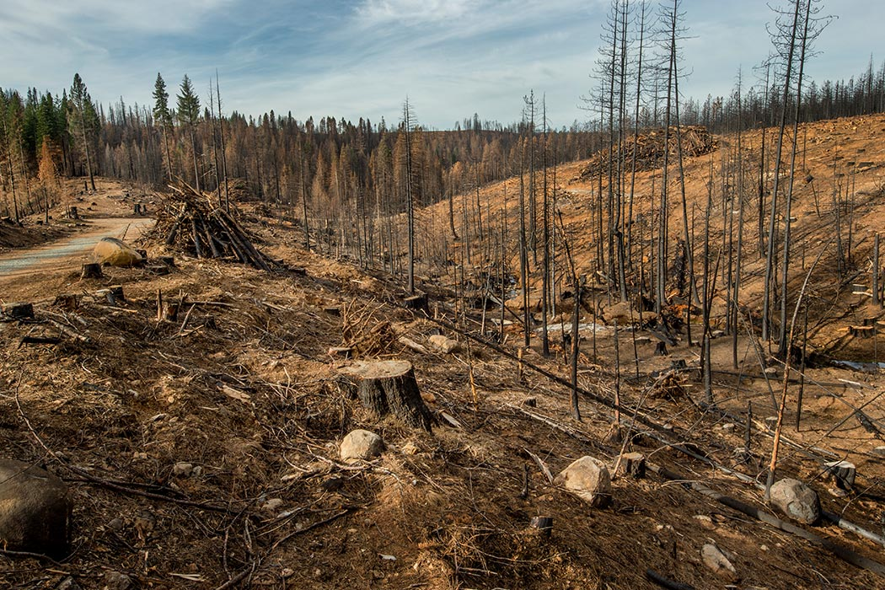

# Effect-of-Deforestation
An extensive study of deforestation data using SQL was performed, providing ecological patterns and insight. Findings revealed trends, the effect on various income levels was evaluated, and the areas with the highest levels of forest cover were identified.

           

## Introduction
Using technical database querying techniques, I examined and interpreted large datasets about worldwide deforestation patterns in this significant SQL project that addressed deforestation. 🌍🤻💻I revealed important information on nations, regions, socioeconomic categories, land areas, and forest areas by utilizing SQL. This research supports well-informed decisions for environmental protection and sustainable forestry management. 

_**Disclaimer**_ ⚠️- _The dataset and reports presented are fictitious, serving as a demonstration of SQL skills and do not represent any actual company, institution, or country. 📊🚫 #SQLAnalysis #DeforestationInsights #EnvironmentalConservation 🌲._

## TASKS AND QUESTIONS...
The task will address the following: 

**Tasks**                                       |  **Questions**             
:----------------------------------------------:|:--------------------------------:
                                   |                  
       

## Problem Statement:

Despite global awareness of deforestation, comprehensive insights into the intricate dynamics of affected countries, regions, income groups, and environmental factors are lacking. This project aims to address this gap by utilizing advanced SQL techniques to analyze extensive datasets, enabling informed decision-making for sustainable forestry management and effective environmental conservation strategies.

## Skill and Concept Demonstrated:

It demonstrated a range of essential data management skills, such as:
- CRUD (Create, Retrieve, Update, Drop)
- Aggregate Functions
- CTE (Common Table expression)
- Data Scrubbing
- Joins
- Analytical
- Problem-Solving

## Data Cleaning

Having established the 'Deforestation_PJT' database, I ensured its selection before proceeding to import the three distinct datasets: "forest_area," "land_area," and "regions." Subsequently, I examined the table layouts and contents, scrutinizing for any NULL values.

### *Pictural representation of the two tables*

**How to import file**                            |  **Brief overview of the tables**             
:------------------------------------------------:|:---------------------------------------:
                                   |                  

### *Modification to the table*
Performing updates on the tables, I conducted a thorough examination for NULL values in the numerical columns of the "forest_area" and "land_area" tables; **316** and **78** rows were affected respectively. Following this assessment, I calculated the average forest and land areas, utilizing these values to substitute for any identified NULL values in the respective columns and rounded the values in the "forest_area_sqkm" and "total_area_sq_mi" columns to two decimal places. To ensure the accuracy of the replacement process, I revisited the columns for verification, **11,772** rows were cleaned. This is shown below:

  Befrore 😧😧                                 |   After 🙂😃                
:----------------------------------------------:|:--------------------------------:
                                    |                      

## Data Analysis and Visualization
### Question ONE: Totoal number of countries involved in deforestation
Using the aggregate function (count), I was able to identify **218** countries involved in deforestation. Identifying **218** countries involved in deforestation suggests a widespread global issue, with a significant number of nations contributing to or being impacted by deforestation.

### Question TWO: Show the income groups of countries having total area ranging from 75,000 to 150,000 square meter
🤔🤔 To address this, I employed the JOIN operation, utilizing the ON condition to link the "Regions" and "Forest_area" tables. The connection was established through the common key, the "country_code" column, leveraging the BETWEEN and AND operators to filter data based on income groups and total forest areas.

_N:B🔥🧑‍🚒 I used the manual way "Design Query in Editor" with minor input_ as shown below:😉😉

  Query Designer                                 |   Main Code 😃                
:-----------------------------------------------:|:--------------------------------:
                                      |               

### Question THREE: Calculate average area in square miles for countries in the 'upper middle income region'. Compare the result with the rest of the income categories.
😓😅 Using the Query Designer with minimal input, I employed functions like ROUND, AVG, and operators such as AS, JOIN, ON, GROUP BY, HAVING, and != to respond to the query. I connected the "Regions" and "land_area" tables via the common key "country_code." With **56 countries** in the upper middle income group spanning **6 regions**, I contrasted this outcome with other income groups by selecting those NOT in the 'upper middle income' category. This alternative syntax yielded **162 countries** outside the upper middle income region. This is represnted below:

### Question FOUR: Determine the total forest area in square km for countries in the 'high income' group. Compare result with the rest of the income categories.
In addressing this query, I employed functions like SUM, AS, and operators such as JOIN, ON, GROUP BY, HAVING, and !=. I linked the "Regions" and "Forest_area" tables via the common key "country_code." With **80 countries** in the high-income group displaying diverse forest area ranges, I contrasted this outcome with other income groups by selecting those NOT in the 'high income' category. This alternative approach yielded **138 countries** outside the high-income region. See below:

### Question FIVE: Show countries from each region(continent) having the highest total forest areas.
In addressing this query, I utilized functions such as ROUND and SUM, along with operators like AS, JOIN, ON, DESC, GROUP BY, ORDER BY, DENSE_RANK, OVER, and PARTITION BY. I linked the "regions" and "forest_area" tables through the common key "country_name," incorporating aliases (r and f) for clarity. The outcome revealed **8 countries** spread across 8 distinct regions.

## CONCLUSION
1. **Total Countries in Deforestation:**
   - Insight: Identified the overall scope of countries contributing to deforestation, providing a baseline for targeted environmental interventions.

2. **Income Groups and Total Area:**
   - Insight: Revealed income groups of countries with specific total area ranges, aiding in understanding land-use patterns and potential socio-economic factors influencing deforestation.

3. **Average Area in 'Upper Middle Income' Region:**
   - Insight: Calculated the average land area for countries in the 'upper middle income' category, allowing for nuanced analysis of deforestation trends within this specific economic segment.

4. **Total Forest Area in 'High Income' Group:**
   - Insight: Determined the total forest area for 'high-income' countries, facilitating a comparative analysis against other income categories and highlighting potential disparities in conservation efforts.

5. **Countries with Highest Total Forest Areas by Region:**
   - Insight: Identified countries within each region with the highest total forest areas, offering insights into regional variations in forest conservation needs and priorities.

These analyses collectively provide a comprehensive understanding of deforestation trends, associating factors, and potential areas for targeted environmental conservation efforts. The data-driven insights contribute to informed decision-making for sustainable forestry management and global environmental conservation strategies.

# THANK YOU !
## Acknowledgemnent 🙏 🙏

Online sources were used to obtain the first amd the last image in this documentation:
- https://www.change.org/p/justin-trudeau-for-every-tree-cut-down-2-planted
- https://spiritof1876.com/blogs/news/the-ultimate-guide-to-help-prevent-deforestation-by-rachel-brown-1

